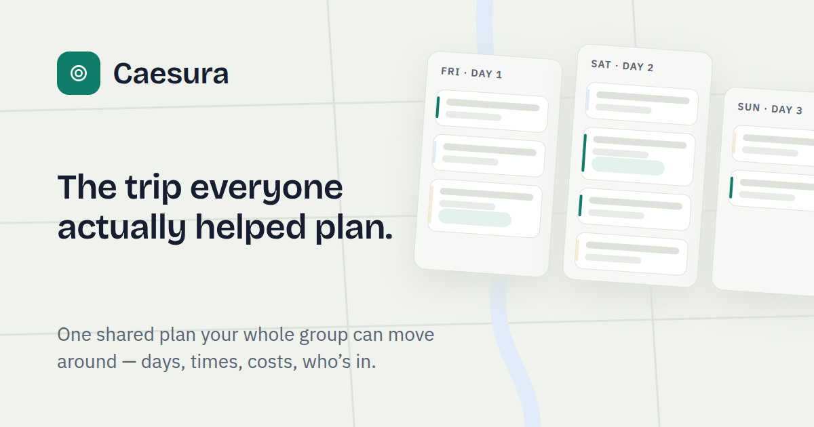

# Caesura (travel-collab)

**The trip everyone actually helped plan.** Caesura is collaborative travel
planning: one shared plan your whole group can move around — days, times,
costs, who's in — with an immutable change history underneath, so nothing
anyone does is ever lost.

<p align="center">
  
</p>

## What it does today

The full single-player product is live (Vercel + Neon, Google sign-in), plus
the first slices of what comes after:

- **Plan a trip as days and stops.** A drag-to-plan day-column board with an
  unscheduled rack for ideas that don't have a slot yet, plus three more
  lenses over the same plan: **Timeline**, **Calendar**, and **Map**
  (MapLibre, geocoded stops).
- **Conflicts are data, not errors.** Time overlaps and impossible geography
  are detected by a pure rule engine and shown inline — with a one-click fix
  or an explicit dismiss. Nothing ever blocks an edit.
- **Full history and time travel.** Every change is an event in an append-only
  log: browse history, undo, revert to any earlier state. Multi-step edits
  commit as one atomic change, and the UI updates optimistically with a save
  indicator that owns up to failures.
- **Money.** Per-stop costs roll up to day and trip totals, against a trip
  budget and currency, visible in every lens.
- **A notebook per trip.** Prose pages outside the time-travel history, for
  the notes that aren't schedule.
- **An AI assistant** that turns natural language into the same validated
  commands the UI dispatches — schema-constrained so it can only propose
  changes the domain would accept, behind a feature-flag kill switch with a
  simulated mode for development and CI.
- **A real front door.** Landing page, custom sign-in/sign-up, trip
  lifecycle (rename, dates, duplicate, archive/delete).

Collaboration, share links/forking, community, and the richer AI
conversation are later phases of the same roadmap — see below.

## Architecture in one paragraph

A modular monolith in a TypeScript monorepo, deployed as one Next.js app.
The **planning domain is event-sourced**: every trip change flows
`command → validate → append event → update projections`; projections are
disposable and rebuildable, and history/undo/fork fall out of the log.
Identity, access, and community metadata are ordinary CRUD — the substrate
is deliberately scoped (ADR-003). Conflicts (scheduling overlaps, broken
date anchors, concurrent edits) are first-class data the user resolves,
never blocking errors. Architectural boundaries are enforced by lint walls,
not convention: the domain core is pure (no I/O, no clock reads), and UI
code cannot import server internals. See ADR-001/002/003 in
`docs/architecture/`.

## Layout

```
AGENTS.md              Operating manual — read first (module map, invariants, DoD)
docs/STATUS.md         Where the work actually is right now (read this second)
TODO.md                High-level roadmap checklist
docs/specs/            Design specifications (foundation decision record)
docs/architecture/     ADRs (decision records)
docs/milestones/       Milestone scopes M0–M18 and exit gates
docs/guidelines/       How to build, connect, validate, and enforce quality
docs/contracts/        Contract change log
docs/known-issues.md   Known issues & tech debt (unfixed-but-known)
packages/contracts/    Zod schemas — the shared language between all layers
packages/domain/       Pure domain core: event sourcing, conflict engine, projections
packages/predict/      Client-side optimistic prediction over the same domain core
packages/pages/        Notebook page model: macro registry, templates (pure)
packages/factories/    One typed test-data vocabulary for every suite
apps/web/              Next.js app — UI + server, separated by a lint wall
```

## Getting started

Prereqs: Node 22+, [pnpm](https://pnpm.io), Docker (for local Postgres).

```sh
pnpm install
pnpm setup                      # copies .env.example → apps/web/.env.local
docker compose up -d            # Postgres 17 on :5433
pnpm --filter web db:reseed     # migrate + seed a demo trip
pnpm --filter web dev           # http://localhost:3001
```

The defaults work as-is: sign in with the username-only **Dev Login**
(`AUTH_DEV_LOGIN=true`; never set in production) — Google OAuth, geocoding,
and AI keys are optional locally (`.env.example` documents each). The AI
endpoint runs in simulated mode unless deliberately switched live
(ADR-019's kill switch).

## Quality gates

```sh
pnpm check                          # typecheck + lint walls + unit tests
pnpm --filter web test:int          # integration tests (real Postgres)
pnpm --filter web test:e2e:ci-like  # Playwright against a production build
```

`pnpm lint` at the root is more than ESLint: it also enforces the
architecture lint wall, the design-system color wall, and filename-case
collisions. E2E verdicts only count from `test:e2e:ci-like` — the dev-server
lane compiles routes on first hit and times out in ways CI never sees
(`CLAUDE.md` rule 1). The full definition of done is in `AGENTS.md`.

## Roadmap

Work proceeds through gated milestones — a milestone is done when its exit
gate (demo script, full test suite, retro note) passes, and status flags flip
in one commit. Phase 1 (M0–M8: walking skeleton → planning core → time
travel → place & time → money → design system → atomic changes → solo
delight → make it real) is complete, as are M10 (visual craft) and M15
(front door). The live pointer to the current milestone and everything in
flight is **`docs/STATUS.md`**; scope for every milestone is the table in
`docs/milestones/README.md`.
